# 🏦 QuickLoan — Scalable Loan Application Web Platform on AWS

**Prepared by:** Shyam Nair
**Category:** Cloud Computing / DevOps
**Platform:** Amazon Web Services (AWS)

QuickLoan is a PHP-based loan application platform, deployed end-to-end on AWS with a custom VPC, EC2, Amazon RDS, Amazon S3, an Application Load Balancer, an Auto Scaling Group, and full CloudWatch + SNS monitoring — verified with a real, live load test.

---

## 📊 Project Workflow

Every stage of this build, in the exact order it happened:

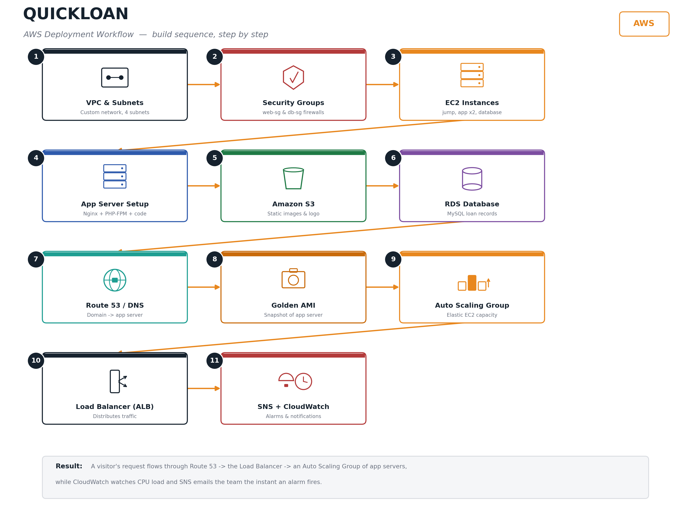

## 🗺️ Network Architecture

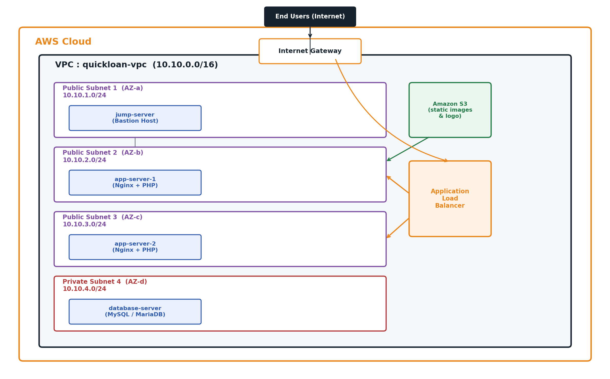

> The jump-server is the only instance reachable directly from the internet over SSH. Every other server is reached by hopping through it over a private IP — the database is never exposed publicly.

---

## 📁 Folder Structure

```
QuickLoan-AWS-Project-ShyamNair/
├── 01-Documentation/
│   └── QuickLoan_AWS_Project_Documentation.docx   → Full 35-page written report
├── 02-Presentation/
│   └── QuickLoan_AWS_Project_Presentation.pptx    → Slide deck
├── 03-Source-Code/
│   ├── includes/db_connect.php
│   ├── nginx/quickloan.conf
│   └── public/ (index.html, apply.php, submit_application.php, styles.css, images/)
├── 04-Architecture-Diagram/
│   ├── quickloan_workflow.png            → NEW numbered service workflow diagram
│   └── network-architecture-diagram.png
├── 05-Screenshots/                        → 58 real screenshots, organized by stage
│   ├── 01-VPC-Networking/ … 14-Route53-DNS/
└── README.md                              → you are here
```

---

## 🛠️ Technology Stack

| Layer | Technology |
|---|---|
| Frontend | HTML5, CSS3, JavaScript |
| Backend | PHP 8.2 (PHP-FPM) |
| Web / Reverse Proxy | Nginx |
| Database | Amazon RDS (MySQL) |
| Static Assets | Amazon S3 |
| Compute | Amazon EC2 (Amazon Linux 2023) |
| Scaling & Availability | Auto Scaling Group + Application Load Balancer |
| Monitoring & Alerting | Amazon CloudWatch + Amazon SNS |

## ☁️ AWS Services Used

`Amazon VPC` · `Amazon EC2` · `Internet Gateway` · `NAT Gateway` · `Route Tables` · `Security Groups` · `Amazon S3` · `Amazon RDS` · `AMI` · `Auto Scaling Group` · `Application Load Balancer` · `Amazon CloudWatch` · `Amazon SNS` · `Route 53 / DNS`

---

## 🚀 Step-by-Step Deployment Guide

### 1. Create the VPC and Networking Components

Build the isolated network that hosts every resource in this project.

| Subnet Name | CIDR Block | Availability Zone | Type |
|---|---|---|---|
| public-subnet-1 | 10.10.1.0/24 | AZ-a | Public (jump-server) |
| public-subnet-2 | 10.10.2.0/24 | AZ-b | Public (app-server-1) |
| public-subnet-3 | 10.10.3.0/24 | AZ-c | Public (app-server-2) |
| private-subnet-4 | 10.10.4.0/24 | AZ-d | Private (database) |

<p align="center">
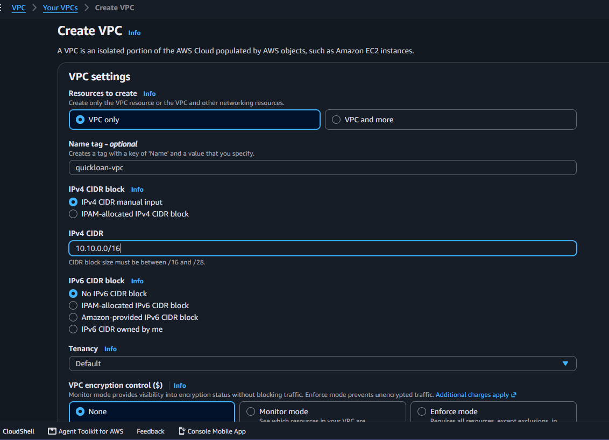 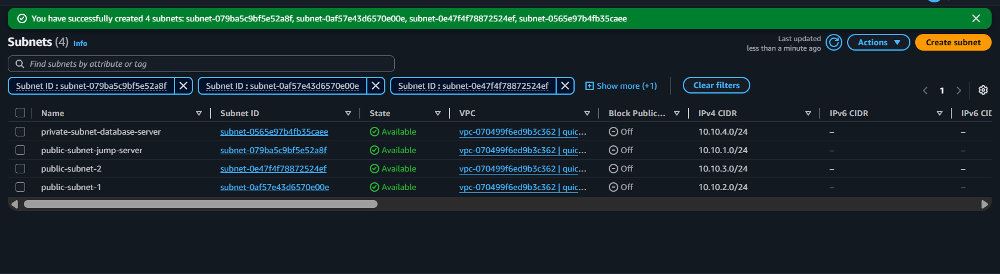
</p>

1. Create the VPC (custom CIDR block, e.g. `10.10.0.0/16`).
2. Create the four subnets listed above.
3. Create and attach an **Internet Gateway**.
4. Create a **public route table**, associate the three public subnets, and add a `0.0.0.0/0` route to the Internet Gateway.
5. Create a separate **private route table** for the private subnet (no direct internet route).
6. (Optional) Create a **NAT Gateway** in a public subnet and route the private subnet's outbound traffic through it, for OS package updates.

<p align="center">
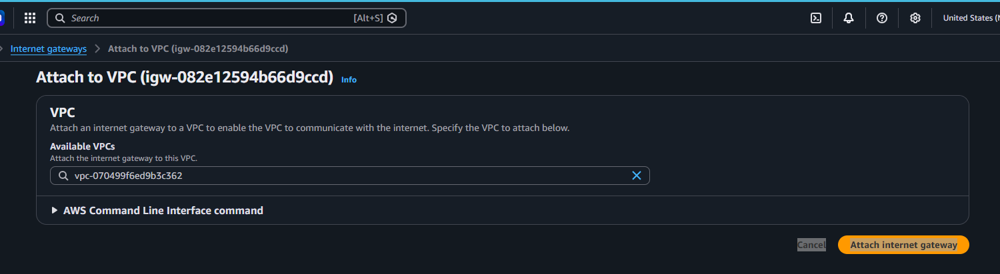 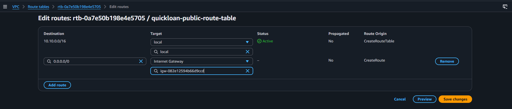
</p>

### 2. Create Security Groups

| Security Group | Inbound Rules | Attached To |
|---|---|---|
| `web-sg` | 22 (SSH, from jump only) · 80/443 from 0.0.0.0/0 | jump-server, app-server(s) |
| `db-sg` | 3306 (MySQL) from `web-sg` only · 22 from jump only | database (RDS) |

<p align="center">
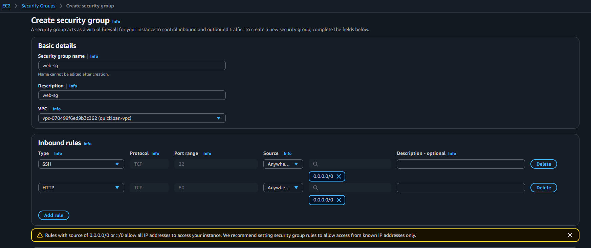 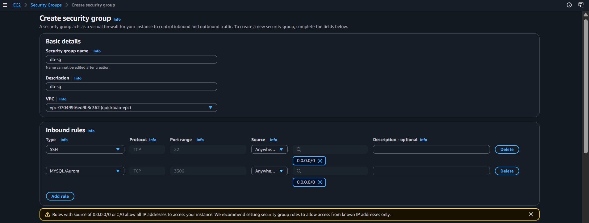
</p>

### 3. Launch the EC2 Instances

Launch a **jump-server** (public-subnet-1) and one or more **app-server** instances (public-subnet-2/3), each with the correct security group and a dedicated key pair.

<p align="center">
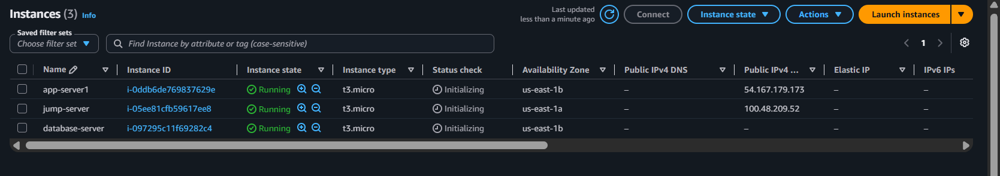
</p>

> 💡 **Tip:** create and download a separate `.pem` key pair for each server role — they can't be re-downloaded once created.

### 4. Connect All Servers via the Jump Server

Copy each server's private key onto the jump server so you can hop to the app/database servers without exposing keys to the internet:

```bash
scp -i jump-keypair.pem app-server.pem ec2-user@<jump-server-public-ip>:~
chmod 400 app-server.pem
```

<p align="center">
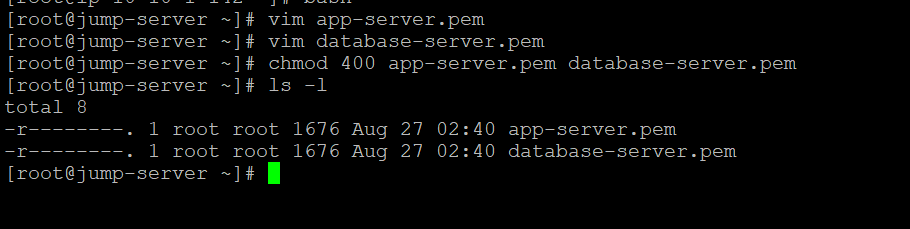
</p>

### 5. Configure the Application Server (Nginx + PHP)

```bash
ssh -i app-server.pem ec2-user@10.10.2.203

sudo yum update -y
sudo yum install -y nginx
sudo systemctl start nginx && sudo chkconfig nginx on

sudo yum install -y php8.2 php-fpm php-mysqlnd php-pdo php-mbstring
sudo systemctl start php-fpm && sudo chkconfig php-fpm on
sudo systemctl restart nginx
```

<p align="center">
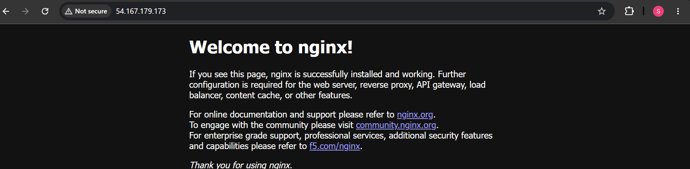
</p>

### 6. Deploy the Application Code

Upload `includes/`, `nginx/`, and `public/` with WinSCP, then:

```bash
sudo mv /home/ec2-user/includes /usr/share/nginx/html
sudo mv /home/ec2-user/public   /usr/share/nginx/html
sudo chown -R nginx:nginx /usr/share/nginx/html/public
sudo chmod -R 755 /usr/share/nginx/html/public
```

<p align="center">
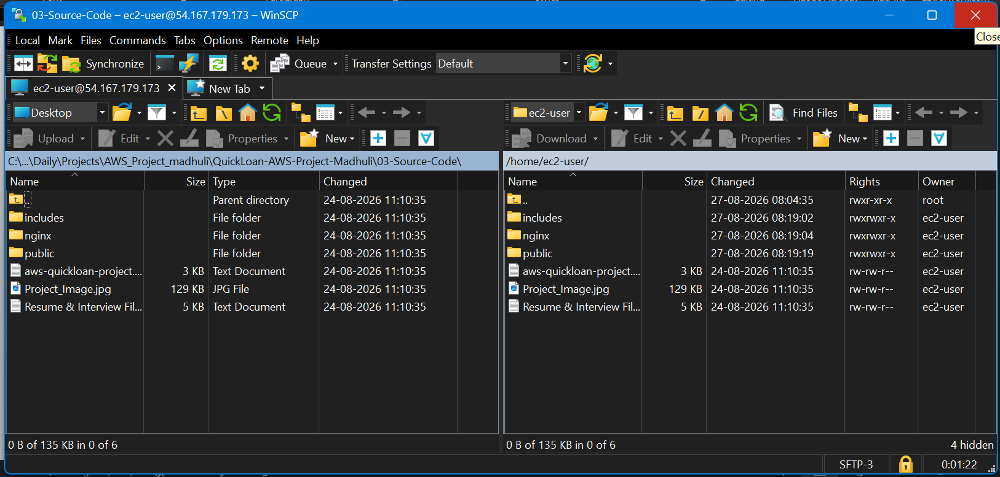
</p>

### 7. Create and Configure the Amazon S3 Bucket

1. Create an S3 bucket with a globally-unique name.
2. Upload the `images/` folder (from `public/`), preserving structure.
3. Set public-read access so images load in browsers.

<p align="center">
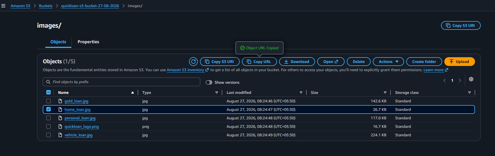
</p>

### 8. Point the Application to the S3 Bucket

```bash
vim /usr/share/nginx/html/public/index.html
:%s/<old-bucket-domain>/<your-bucket>.s3.<region>.amazonaws.com/g

vim /usr/share/nginx/html/public/apply.php
# update the  for the QuickLoan logo similarly
```

### 9. Set Up the Database (Amazon RDS)

1. Open the RDS console → create a MySQL database.
2. Place it in the private subnet group, attach `db-sg`.
3. Copy the endpoint once available, then create the schema:

```sql
CREATE DATABASE quickloan_db;
USE quickloan_db;

CREATE TABLE applications (
    id INT AUTO_INCREMENT PRIMARY KEY,
    name VARCHAR(255) NOT NULL,
    contact VARCHAR(20) NOT NULL,
    email VARCHAR(255) NOT NULL,
    loan_type VARCHAR(50) NOT NULL
);
```

### 10. Connect the Application Server to the Database

```bash
cd /usr/share/nginx/html/includes
vim db_connect.php
# set $servername, $username, $password to your RDS endpoint/credentials
```

> ⚠️ Never commit real credentials to source control — use AWS Secrets Manager in production.

### 11. Configure a Custom Domain Name

Point your domain's DNS at your AWS resources — either an A record straight at the app server / Load Balancer, or via a Route 53 hosted zone.

<p align="center">
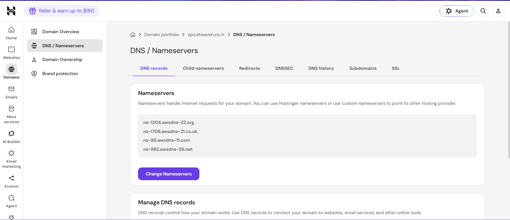
</p>

### 12. Configure the Nginx Server Block

```bash
vim /home/ec2-user/nginx/quickloan.conf
# server_name yourdomain.example;

sudo mv /home/ec2-user/nginx/quickloan.conf /etc/nginx/conf.d/
sudo nginx -t
sudo systemctl restart nginx
```

### 13. Final End-to-End Testing

<p align="center">
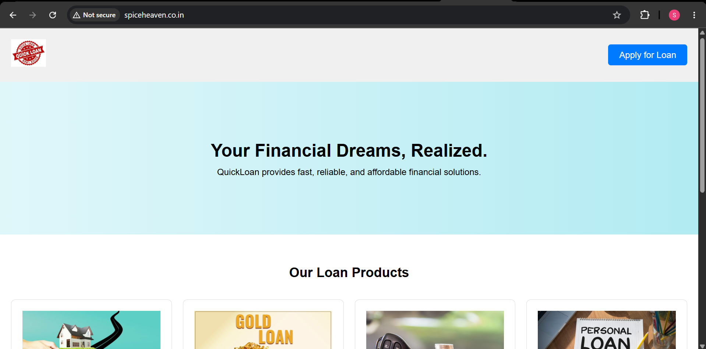 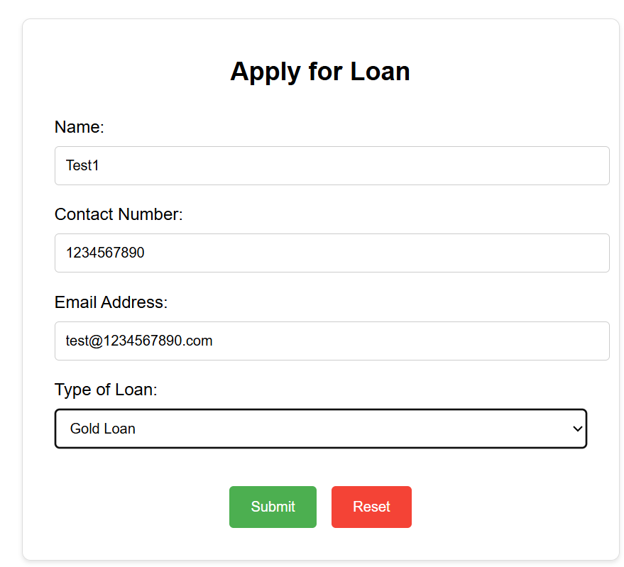
</p>
<p align="center">
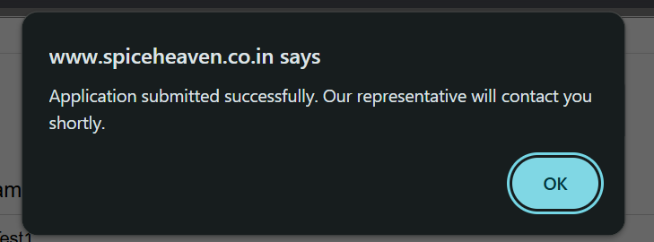 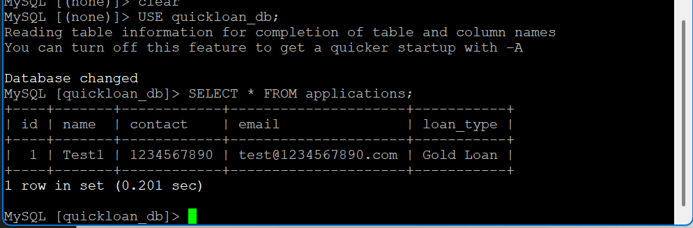
</p>

- ✅ Homepage loads with S3-hosted images
- ✅ Application form submits successfully
- ✅ Submitted record confirmed in the RDS database

---

## 📈 Production Scaling: AMI, Auto Scaling, Load Balancer & Monitoring

### 14. Create an AMI

Once the app server is fully configured and tested, capture it as a reusable AMI.

<p align="center">
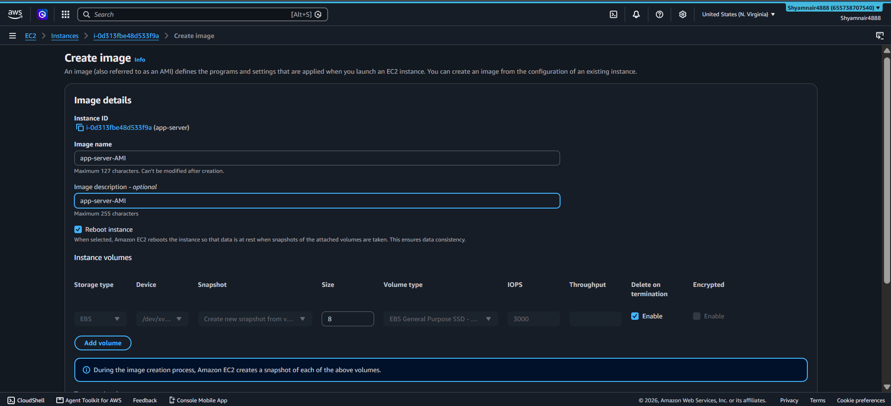 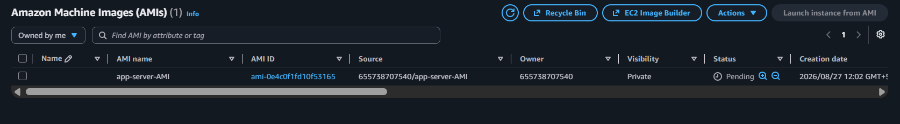
</p>

### 15. Launch Template + Auto Scaling Group

Create a Launch Template from the AMI, then an Auto Scaling Group spanning the public app subnets with a CPU-based scaling policy.

<p align="center">
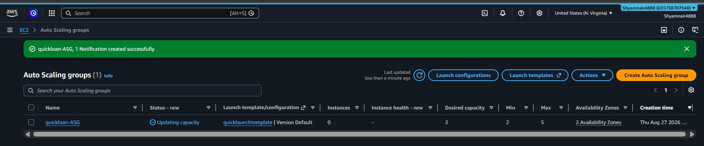 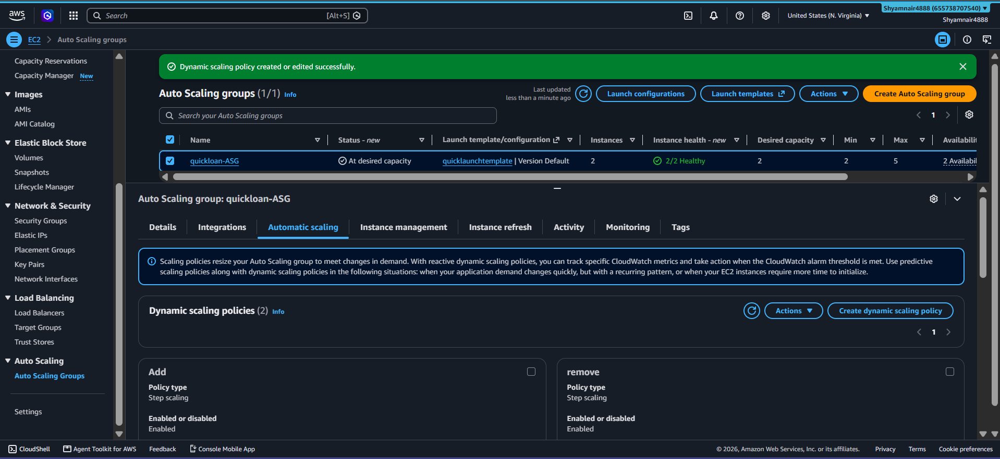
</p>

### 16. Attach an Application Load Balancer

1. Create a target group and register the app server(s).
2. Create an ALB across the public subnets, listener on port 80.
3. Register the target group with the Auto Scaling Group.

<p align="center">
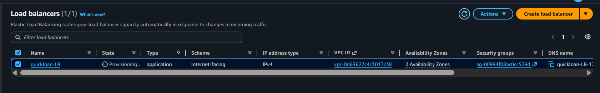 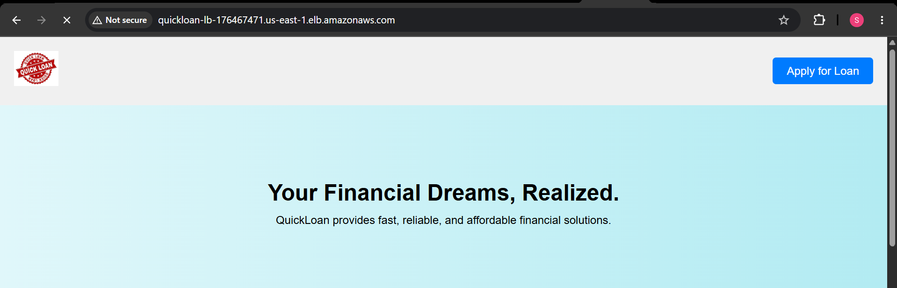
</p>

### 17. Set Up SNS Notifications

1. Create an SNS Standard topic (e.g. `quickloan-asg-alerts`).
2. Subscribe your email to it.
3. Confirm the subscription from the email AWS sends you.

<p align="center">
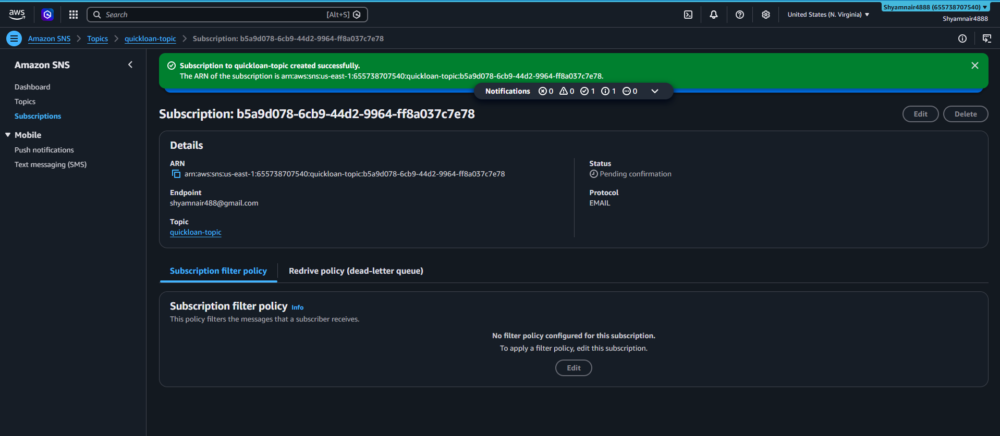 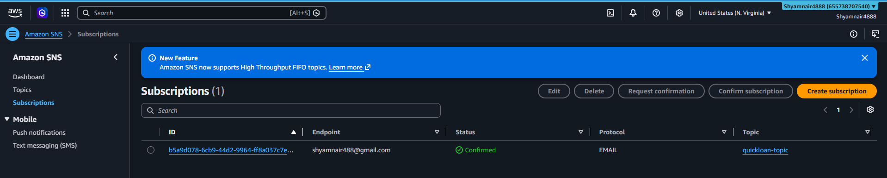
</p>

> Without a **confirmed** subscription, alarms still fire — but nobody is told. Confirming it is what turns a silent alarm into an actionable email.

### 18. Set Up CloudWatch Alarms & Scaling Policies

1. In the ASG's *Automatic scaling* tab, create a target-tracking policy: scale **out** above 80% average CPU, scale **in** below 20%.
2. This auto-creates two CloudWatch alarms (high-CPU / low-CPU).
3. Attach the SNS topic to both alarms so every state change sends an email.

<p align="center">
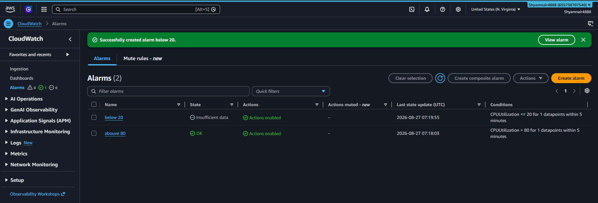 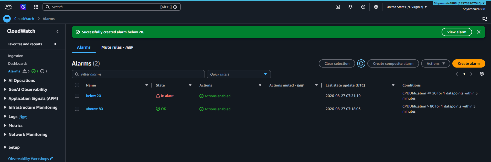
</p>

### 19. Test the Auto Scaling Group

Proving the ASG actually scales under load:

```bash
sudo amazon-linux-extras install epel -y
sudo yum install -y stress-ng

# Load all CPU cores for 10 minutes
stress-ng --cpu $(nproc) --timeout 600s
```

1. Watch the CloudWatch alarm move **OK → In alarm**.
2. Confirm an SNS email arrives immediately.
3. Watch the ASG's *Activity* tab — a new instance launches from the AMI.
4. Confirm the new instance registers healthy in the ALB target group.
5. Stop the load — after the cooldown, the low-CPU alarm fires, another email arrives, and the ASG scales back in.

<p align="center">
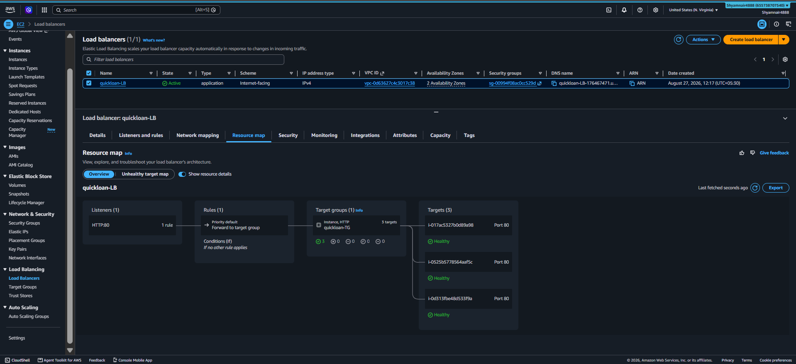
</p>

> ✅ **Verified result:** CloudWatch detects load → the scaling policy launches a new instance → the ALB routes traffic to it → SNS emails the team at every step → and the ASG safely scales back in once load subsides.

---

## 🔒 Security Best Practices Applied

- Database in a private subnet / RDS with no public accessibility.
- Security Groups scoped per role — the database only accepts connections from the web tier.
- A single jump host is the only SSH entry point.
- Separate key pairs per server role.
- Web root permissions locked to what Nginx needs (755), owned by the `nginx` user.
- Credentials isolated in one include file — recommended migration to AWS Secrets Manager.
- CloudWatch + SNS give visibility into every scaling event.

---

## 🧯 Troubleshooting

| Symptom | Likely Cause | Fix |
|---|---|---|
| 502 Bad Gateway | PHP-FPM not running | `sudo systemctl restart php-fpm nginx` |
| Images/logo not loading | S3 URL not updated / not public | Re-check URLs; verify bucket permissions |
| "Connection failed" on submit | Wrong RDS endpoint/creds, or `db-sg` blocking 3306 | Verify `db_connect.php`; confirm SG rule |
| Site unreachable on domain | DNS not propagated / SG blocking 80/443 | Re-check DNS + `web-sg` |
| ASG never scales out | Threshold/alarm misconfigured | Re-check the CloudWatch alarm settings |
| No SNS email | Subscription not confirmed | Re-check SNS subscription status |

---

## 🧹 Cleanup Guide — Delete Everything, In Order

AWS bills for most of these resources even when idle. Delete strictly in this order to avoid dependency errors:

| # | Delete | Why this order |
|---|---|---|
| 1 | CloudWatch Alarms | So nothing re-triggers scaling mid-teardown |
| 2 | SNS subscription + topic | No longer needed once alarms are gone |
| 3 | Auto Scaling Group (scale to 0 first, then delete) | Safely terminates managed instances |
| 4 | Application Load Balancer | Depends on the target group |
| 5 | Target Group | No longer referenced once ALB is gone |
| 6 | Launch Template | No longer referenced once ASG is gone |
| 7 | Deregister AMI + delete its snapshot | Snapshot isn't removed automatically |
| 8 | Terminate remaining EC2 instances | jump-server, any leftover app/db server |
| 9 | Delete the RDS instance | Take a final snapshot first if needed |
| 10 | Empty + delete the S3 bucket | A non-empty bucket can't be deleted |
| 11 | Release Elastic IPs | Unassociated EIPs are billed hourly |
| 12 | Delete Security Groups (`db-sg` before `web-sg`) | `db-sg` references `web-sg` |
| 13 | Delete the NAT Gateway | Holds an Elastic IP |
| 14 | Release the NAT Gateway's Elastic IP | Now unused |
| 15 | Delete custom Route Tables | Never delete the VPC's main route table directly |
| 16 | Detach + delete the Internet Gateway | Must detach before deleting |
| 17 | Delete the Subnets | — |
| 18 | Delete the VPC | Fails if any dependency remains |
| 19 | Delete the Route 53 hosted zone (if created) | — |
| 20 | Revert DNS records at the registrar | If the domain won't be reused |
| 21 | Delete unused key pairs *(optional)* | Final cleanup |

> ⚠️ **Before you start:** take any screenshots, exports, or a final RDS snapshot you want to keep — this process is irreversible.
> ✅ **After finishing:** check AWS Billing / Cost Explorer after 24 hours to confirm nothing is still accruing charges (a missed Elastic IP or NAT Gateway is the most common leftover cost).

Full narrated version with exact console navigation is in `01-Documentation/QuickLoan_AWS_Project_Documentation.docx`, Section 11.

---

## 🎯 Conclusion

QuickLoan demonstrates a complete, real-world AWS deployment: a segmented VPC, role-based EC2 instances, a decoupled S3 asset layer, a managed RDS database tier, and full production readiness through AMIs, Auto Scaling, load balancing, and CloudWatch/SNS monitoring — verified with an actual load test that triggered a real scale-out and scale-in event.

---

*Prepared and documented by Shyam Nair. 🏦*
